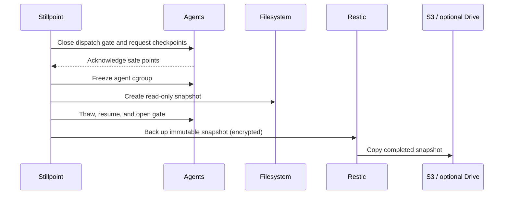

# Stillpoint

Stillpoint is an open-source backup orchestrator for development environments
that are continuously changed by coding agents, build tools, Docker Compose,
and databases.

It coordinates a short consistency barrier, creates an instantaneous read-only
filesystem snapshot, resumes work, and then lets Restic encrypt and back up the
immutable snapshot at normal speed.

> **Project status: pre-alpha bootstrap.** Configuration validation,
> diagnostics, path-safety checks, the run-state model, and failure-safe barrier
> primitives are implemented. The mutating `backup` command is deliberately
> disabled until Btrfs and Restic integration tests prove the recovery path.

## Why Stillpoint?

Git protects committed source history. It does not normally protect untracked
files, local databases, Docker volumes, `.env` files, agent work in progress, or
the complete state of several projects at one instant. A live Restic backup is
safe to run, but files that change while it scans can belong to different
moments.

Stillpoint is designed to close that consistency gap:



The intended pause is only the time between the final acknowledgement and
filesystem snapshot creation—normally seconds—not the duration of the Restic
upload.

## Core safety rules

- Every Restic repository is encrypted; there is no plaintext mode.
- Backup commands never delete source data.
- A repository may not be placed inside a selected source.
- A consistent run fails if an agent does not acknowledge the barrier.
- Unfreeze, resume, and gate-open cleanup is attempted after every partial
  failure and after cancellation.
- A failed remote copy never removes a successful local snapshot.
- Restore defaults to a new, empty location.
- Passwords and secret values must not appear in YAML, arguments, or logs.

See [Threat model](docs/threat-model.md) for the precise protection boundary.

## Current CLI

Requires Go 1.23 or newer for a source build.

```bash
git clone https://github.com/viterineil/stillpoint.git
cd stillpoint
make build

./bin/stillpoint doctor --source /home/neil/dev
./bin/stillpoint config validate --config examples/stillpoint.yaml
./bin/stillpoint plan --config examples/stillpoint.yaml --set development
```

Available now:

| Command | Purpose |
| --- | --- |
| `stillpoint doctor` | Inspect WSL/Linux, source filesystem, Restic, Btrfs, systemd, Docker, Compose, and rclone |
| `stillpoint config validate` | Strictly parse a versioned YAML file and reject unknown fields |
| `stillpoint plan` | Canonicalize paths, reject unsafe nesting, and print the planned consistency/encryption policy |
| `stillpoint version` | Print version, commit, and build date |

`stillpoint backup` returns a safety-gate error in this bootstrap. It will be
enabled only after its complete pause/snapshot/resume/recovery sequence exists.

## Configuration

Start with [examples/stillpoint.yaml](examples/stillpoint.yaml). Its defaults:

- include all source files, including dotfiles, `.git`, ignored, and untracked
  files;
- exclude `node_modules`, `.npm`, `.pnpm-store`, and the node-gyp cache;
- never exclude a generic `packages` folder;
- ask how secret-bearing files should be handled;
- use a cooperative agent barrier plus `agents.slice` as a hard fence;
- use a local encrypted Restic repository, then copy complete snapshots to S3;
- optionally copy to a separate Restic repository on Google Drive via rclone.

Google Drive for desktop should not watch `\\wsl.localhost`, and its virtual
drive should not be the live source or primary Restic repository. A completed,
encrypted Restic snapshot can be copied to Drive afterward via rclone.

Read [Configuration](docs/configuration.md), [Agent protocol](docs/agent-protocol.md),
and [Docker and databases](docs/docker-and-databases.md) before adapting the
example.

## Architecture

Stillpoint is a coordinator, not a new backup format. Its planned stable stack
is:

- Go CLI and durable run-state catalog;
- cooperative command adapters and systemd cgroup fencing;
- Btrfs first, then LVM and ZFS snapshot providers;
- Restic for encryption, deduplication, retention, checking, and restore;
- Docker/Compose discovery and application-aware database adapters;
- Restic `copy` to S3 or an rclone-backed Google Drive repository.

See [Architecture](docs/architecture.md) and [Roadmap](docs/roadmap.md).

## Contributing

This repository is starting in public specifically so safety assumptions can be
reviewed early. Read [CONTRIBUTING.md](CONTRIBUTING.md) and
[SECURITY.md](SECURITY.md). Backup correctness changes need failure-injection
tests and a restore test, not only a successful backup test.

Licensed under the [Apache License 2.0](LICENSE).
